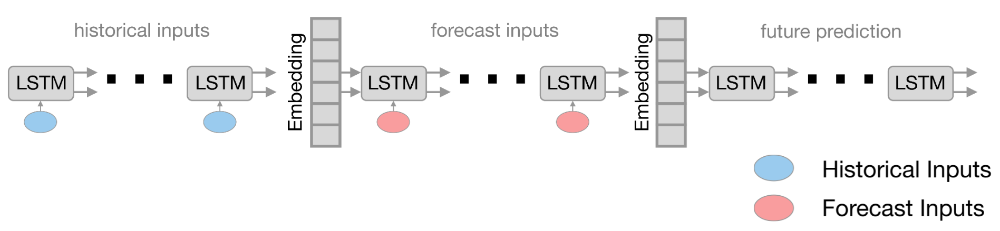

# h2ox-ai
This repo is for training machine learning models for the Wave2Web hackathon.

## Description

The Wave2Web hackathon, organised by the World Resources Institute and sponsored by Microsoft and Blackrock, took place May through September 2021.
The objective of the hackathon was to predict, up to 90 days in the future, the water availability at 4 key reservoirs in the Kaveri basin to the West of Bengaluru.

The machine learning approach taken by the winning team, H2Ox, is developed in this repository.

### Data

This repo contains everything needed to retrain the winning model of the hackathon.
The primary data used to train the models includes historical forcing data from [ECMWF ERA5-Land Archive](https://www.ecmwf.int/en/era5-land).
Meteorological forcing data for the forecast period is obtained from the [ECMWF TIGGE Global Ensemble Forecast](https://www.ecmwf.int/en/research/projects/tigge).
Reservoir levels are obtained in near-real-time from the [India Water Resources Information System](https://indiawris.gov.in/wris/).

This data automatically assembles the data described in [conf.yaml](conf.py)`/data_parameters`.
Data sources are described in individual [DataUnits](h2ox/ai/dataset/data_units.py) which can be easily added to, to add features to the dataset.
A raw [xarray DataSet](https://xarray.pydata.org/en/stable/generated/xarray.Dataset.html) is cached as a `.nc` file to avoid the data needing to be obtained at the beginning of every training iteration.
In this way, this repo is extensible to new locations, and new data sources, in new applications and use cases.

### Model

H2Ox developed a Sequence-to-sequence-to-sequence LSTM model: a three-stage LSTM which 1) encodes historic meteorological forcing data into a latent hydrological state for each reservoir; 2) decodes over a forecast period, while continuing conditioning from forecast data; and 3) decodes further over a future period, with only trigonometic day-of-the-year features as input.

Several configurations are available for training this model.

#### One-Hot-Encoding

The baseline configuration is a one-hot-encoding of each site.
This allows the model to be used to predict water availability at any given site, trained on mismatched amounts of data by site, and learn general relationships between the meteorological forcing data and the site-wise targets.

#### Multi-Target

To be completed.

## Installation

### For use

To use this repo, simply clone it and then pip install it.

    pip install .

### For Development

    # install with "-e" (editable) and [dev] flag to get pre-commit
    pip install -e .[dev]

    # install pre-commit
    pre-commit install

## Training

    python run.py

## Serving

This repo is also set up for production as a dockerised [TorchServe](https://pytorch.org/serve/) instance.
The main entrypoint can be found in `app.py`.
(To Be Completed).
